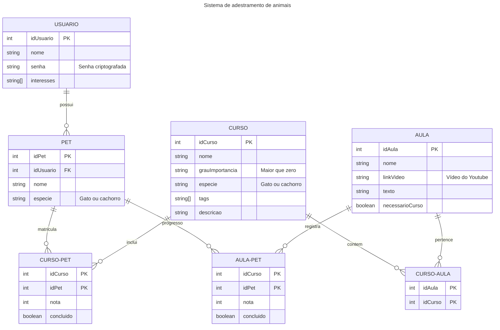

# Diagrama Entidade-Relacionamento

```mermaid
---
title: Sistema de adestramento de animais
---
erDiagram
CURSO {
    int idCurso PK
    string nome
    string grauImportancia "Maior que zero"
    string especie "Gato ou cachorro"
    string[] tags
    string descricao
}
CURSO-AULA {
    int idAula PK
    int idCurso PK
}
AULA {
    int idAula PK
    string nome
    string linkVideo "Vídeo do Youtube"
    string texto
    boolean necessarioCurso
}
USUARIO {
    int idUsuario PK
    string nome
    string senha "Senha criptografada"
    string[] interesses
}
PET { int idPet PK
    int idUsuario FK
    string nome
    string especie "Gato ou cachorro"
}
CURSO-PET {
    int idCurso PK
    int idPet PK
    int nota
    boolean concluido
}
AULA-PET {
    int idCurso PK
    int idPet PK
    int nota
    boolean concluido
}
CURSO ||--o{ CURSO-AULA : contem
AULA ||--o{ CURSO-AULA : pertence
USUARIO ||--o{ PET : possui
PET ||--o{ CURSO-PET : matricula
CURSO ||--o{ CURSO-PET : inclui
PET ||--o{ AULA-PET : progresso
AULA ||--o{ AULA-PET : registra
```
